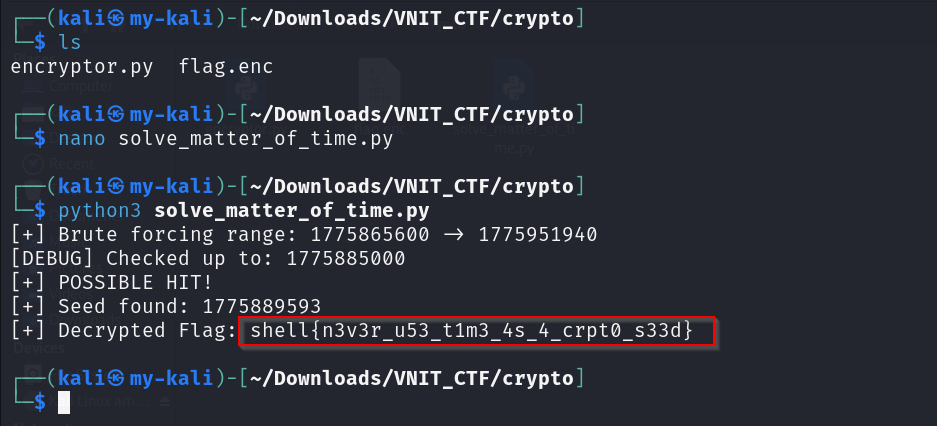

# A Matter of Time

**Category:** Cryptography  
**Points:** 100  

---

## 🧩 Description  
We caught a rogue admin exfiltrating data from the S.H.E.L.L. servers. They used a custom Python script to encrypt the flag before dropping it on a public server.

We managed to grab both the encrypted file (flag.enc) and the script they used to encrypt it (encryptor.py). Server logs indicate the encryption happened on April 11, 2026, between 11:30 AM and 12:30 PM IST.

They think their custom encryption is unbreakable. Write a script to prove them wrong and recover the flag

---

## 📂 Files Provided  
- `flag.enc` — encrypted flag file  
- `encryptor.py` — Python script used for encryption  

---

### 🎯 Approach  

The challenge exploits a **weak pseudo-random number generator (PRNG)** seeded using time.

Since:
- The seed is based on system time  
- The time window is known  

👉 We can brute-force the seed to recover the key.

---

## 🛠️ Steps  

1. Analyze `encryptor.py`  
   - Identify use of `random.seed(time)`  

2. Convert given time range into Unix timestamps  

3. Write a brute-force script:
   - Iterate through all possible timestamps  
   - Regenerate keystream  
   - Attempt decryption  

4. Check output for readable text  

5. Once valid output is found → extract flag  

   

---

## 🏁 Flag  
shell{n3v3r_u53_t1m3_4s_4_crpt0_s33d}

---

## 🧠 Key Learning  

- Time-based seeds are predictable  
- Weak randomness breaks encryption  
- Always use cryptographically secure RNG 
