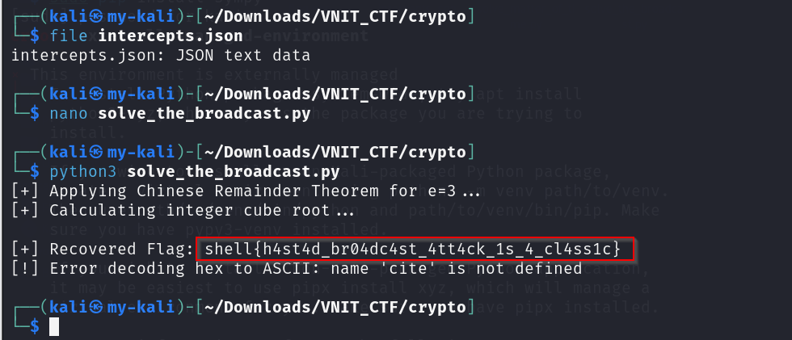

# The Broadcast

**Category:** Cryptography  
**Points:** 200  

---

## 🧩 Description  
The S.H.E.L.L. mainframe broadcast an unpadded message to three servers using e=3 and unique RSA moduli. Recover the original message. (Once the result is found, simply calculate the integer cube root to reveal the flag.)

---

## 📂 Files Provided  
- `intercepts.json` — file containing RSA ciphertexts and moduli  

---

## 🎯 Approach  

This challenge uses **Håstad's Broadcast Attack**.

Conditions:
- Same plaintext sent to multiple recipients  
- Small exponent (`e = 3`)  
- No padding  

👉 This allows recovery of the original message using **Chinese Remainder Theorem (CRT)**.

---

## 🛠️ Steps  

1. Inspect `intercepts.json`  
   - Extract ciphertexts and moduli  

2. Apply **Chinese Remainder Theorem (CRT)**  
   - Combine values into a single result  

3. Compute integer cube root  
   - Reverse exponentiation (`e = 3`)  

4. Convert result:
   - Integer → Hex → ASCII  

5. Extract flag  

   

---

## 🏁 Flag  
shell{h4st4d_br04dc4st_4tt4ck_1s_4_cl4ss1c}

---

## 🧠 Key Learning  

- RSA without padding is insecure  
- Small exponent attacks are dangerous  
- CRT is powerful in cryptanalysis  
