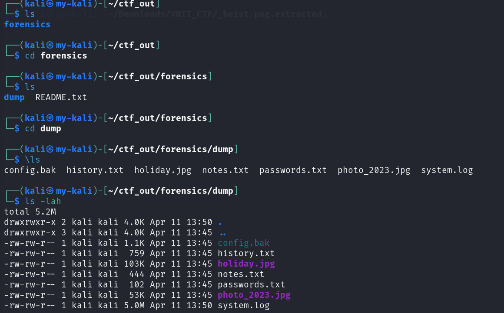
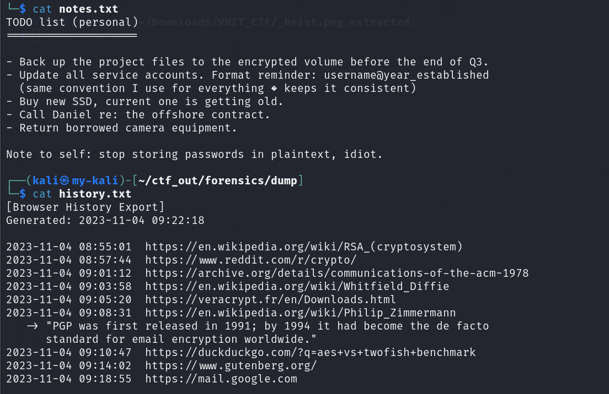
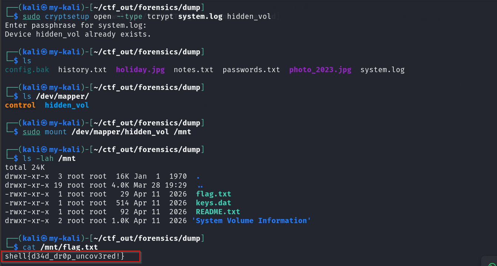

# Dead Drop

**Category:** Digital Forensics  
**Points:** 300  

---

## 🧩 Description
A suspected insider was caught copying files before his account was disabled. We managed to pull his workstation dump before IT wiped it. Something in there doesn't belong. Identify it and obtain the flag.

---

## 📂 Files Provided

- Workstation dump containing multiple files (logs, notes, history).

---

## 🎯 Approach
The challenge required analyzing a workstation dump to identify anomalous files and uncover hidden data.

By correlating user activity, file sizes, and suspicious patterns, the goal was to locate a disguised encrypted container and extract its contents.

---

## 🛠️ Steps

1. Perform initial enumeration:
   ```bash
   ls -lah
   ```
   
   
2. Analyze key files:
  - history.txt → check for encryption-related searches
  - notes.txt → look for hints about hidden volumes
  
  

3. Identify anomaly:
  - system.log had unusually large size (~5MB)
  - Not consistent with normal log files

4. Hypothesis:
  - The file is likely a disguised encrypted container

5. Attempt mounting using tools like:
  - VeraCrypt
  - cryptsetup

6. A passphrase was required to unlock the volume.
  Based on contextual clues from system artifacts, the password was likely:
  ```bash
  Phantom@1994
  ```

7. Mount the volume:
  ```bash
  sudo cryptsetup open system.log hidden_volume
  ```

8. Navigate to mounted directory:
  ```bash
  cd /mnt/
  ls
  ```

9. Retrieve the flag:
  ```bash
  cat flag.txt
  ```
  

---

## ⚠️ Note

The exact origin of the passphrase is not fully documented.
However, it was likely derived from contextual clues found within system artifacts (such as notes or history files).

Note: Writeup recreated post-CTF; some minor steps may differ from the original solve path.

---

## 🏁 Flag

shell{d34d_dr0p_uncov3red!}

---

## 🧠 Key Learning
- Always look for anomalies in file size and behavior
- Logs can be disguised as encrypted containers
- Correlating multiple artifacts (history, notes, logs) is crucial in forensics
