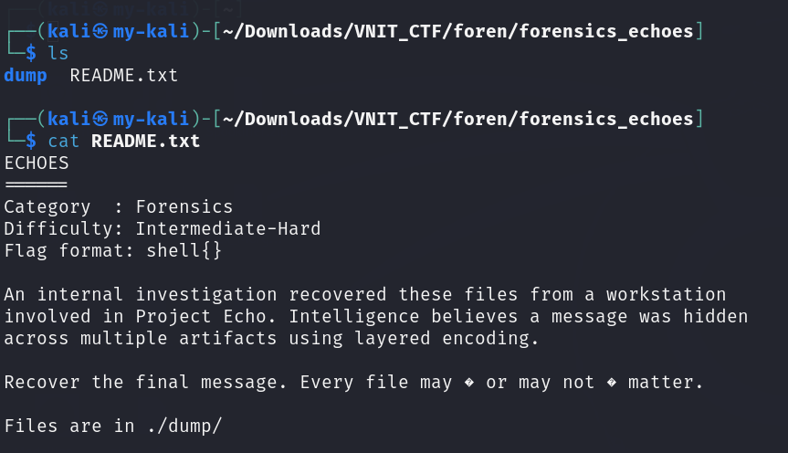
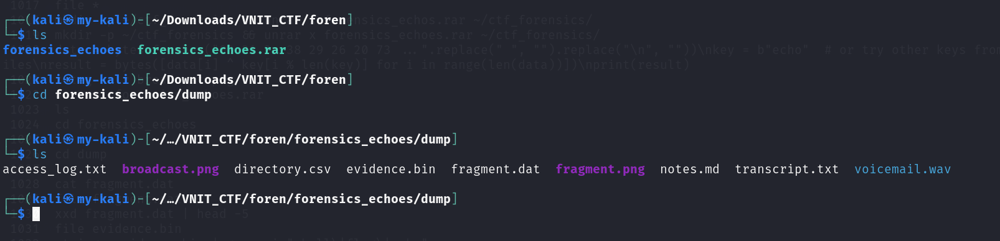
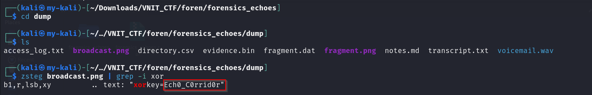
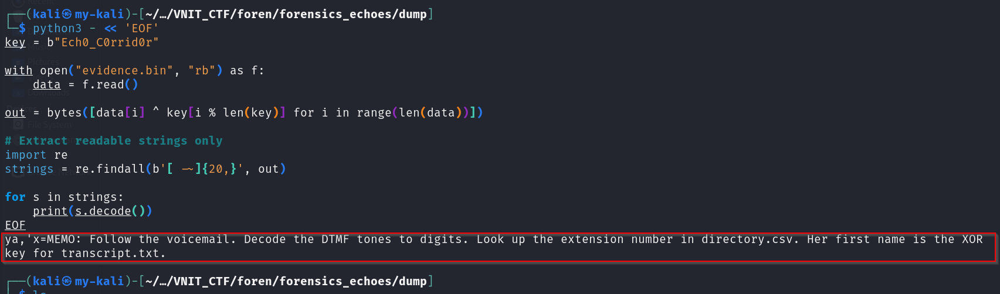
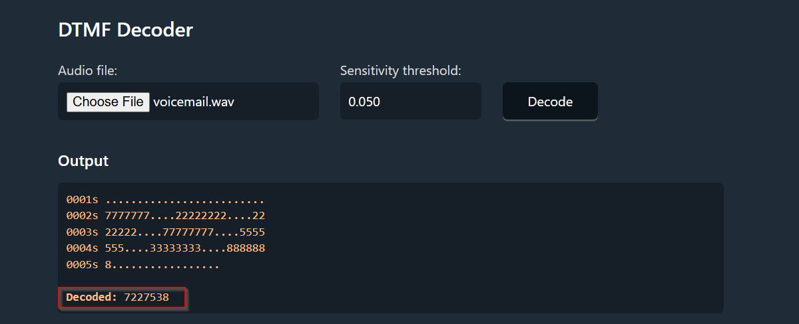
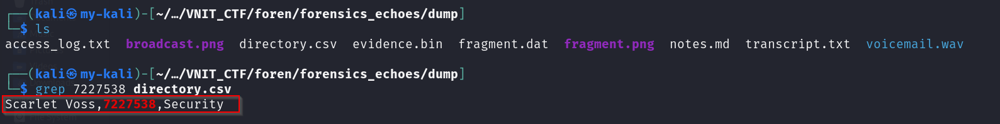
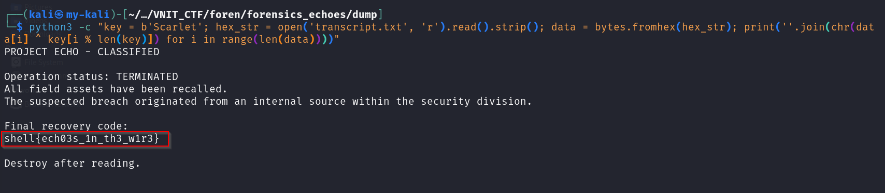

# Echoes

**Category:** Digital Forensics  
**Points:** 400  

---

## 🧩 Description

No description was provided directly in the challenge interface.

However, after extracting the provided archive, a `README.txt` file was found containing the actual challenge description:

> An internal investigation recovered these files from a workstation involved in Project Echo. Intelligence believes a message was hidden across multiple artifacts using layered encoding.  
>
> Recover the final message. Every file may or may not matter.  
>
> Files are in ./dump/



---

## 📂 Files Provided

- `forensics_echoes.rar` — archive containing multiple challenge files

---

## 🎯 Approach
This was a multi-layered forensics challenge requiring sequential decoding across different file types.

The strategy followed a **“follow the breadcrumbs”** approach:
- extract archive → read hidden instructions → uncover key → decrypt binary → analyze audio → map data → final decryption  

---

## 🛠️ Steps

1. Extract archive
   ```bash
   unrar x forensics_echoes.rar
   ```
  This reveals:
  - dump/ directory
  - README.txt

2. Analyze extracted files
   Navigate into dump directory:
   ```bash
   cd dump
   ls
   ```
   Files found:
   - broadcast.png
   - evidence.bin
   - voicemail.wav
   - directory.csv
   - transcript.txt
   

3. Extract hidden data (Steganography)
   Analyze broadcast.png for hidden content
   Extract Least Significant Bits (LSB)
   Result:
   ```bash
   Ech0_C0rrid0r
   ```
   

4. XOR Decryption
   Use extracted key to decrypt evidence.bin
   XOR decryption logic (simplified)
   Output revealed:
   - Reference to DTMF tones
   - Mention of directory lookup
   


5. Audio Analysis
   Analyze voicemail.wav using a DTMF decoder
   Extracted digits:
   ```bash
   7227538
   ```
   

6. Directory Lookup
   Search directory.csv using extracted digits
   Result:
   ```bash 
   Scarlet Voss
   ```
   

7. Final Decryption
   Use keyword:
   ```bash
   Scarlet
   ```
   Apply XOR on hex data from transcript.txt
   Final output reveals the flag

   

   ---

## 🏁 Flag

shell{ech03s_1n_th3_w1r3}

--- 

## 🧠 Key Learning
- Always inspect extracted files carefully — important clues may be hidden there
- Multi-layer challenges require structured, step-by-step thinking
- Combining steganography, cryptography, and data analysis is key
- “Every file may or may not matter” → prioritization is important


