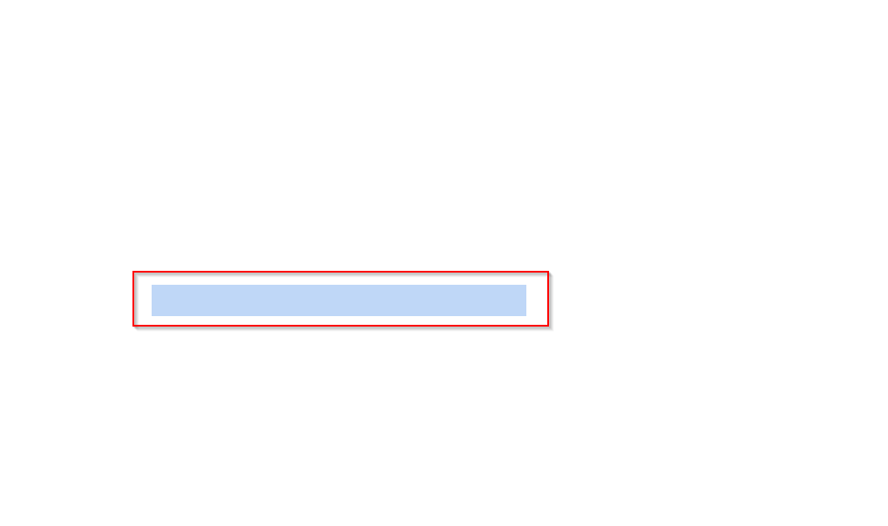

#  Blank PDF

**Category:** Misc  
**Points:** 100  

---

## 🧩 Description  
The PDF is blank... you agree, right? Don't waste your time looking for something that isn't there.

---

## 📂 Files Provided  

- `blank_pdf.pdf` — A Blank PDF was given. 

---

## 🎯 Approach  

This challenge is based on **visual deception**.

Even if a PDF appears blank, content may still exist:
- Hidden text  
- Same color as background  
- Layered objects  

---

## 🛠️ Steps  

1. Open the PDF file  
2. Press `CTRL + A` to select all content

   

    
3. Hidden text becomes visible  
4. Extract the flag  

---

## 🏁 Flag
SH3LL{bl4nk_pdf_1s_n07_bl4nk}

---

## 🧠 Key Learning  

- Never trust visual appearance  
- Always check hidden layers/content  
- Simple tricks can hide data effectively  

