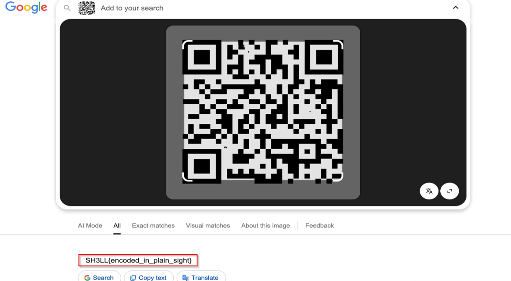

# Broken Scan

**Category:** Misc  
**Points:** 100  

---

## 🧩 Description  
A QR code was generated, but the process was interrupted. Can you reconstruct what was meant to be hidden?

---

## 📂 Files Provided  

- `qr_broken.png` — damaged or incomplete QR code image requiring reconstruction.

---

## 🎯 Approach  

This is an **image reconstruction challenge**.

- QR code is damaged/incomplete  
- Needs fixing before scanning  

---

## 🛠️ Steps  

1. Open QR image  
2. Identify missing/damaged areas  
3. Reconstruct using:
- Image editor (GIMP / Photoshop)  
- QR repair tools  

4. Scan reconstructed QR  
   

5. Extract flag  

---

## 🏁 Flag
SH3LL{encoded_in_plain_sight}

---

## 🧠 Key Learning  

- QR codes tolerate small errors  
- Reconstruction can recover data  
- Visual fixing is sometimes enough  

