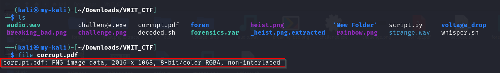
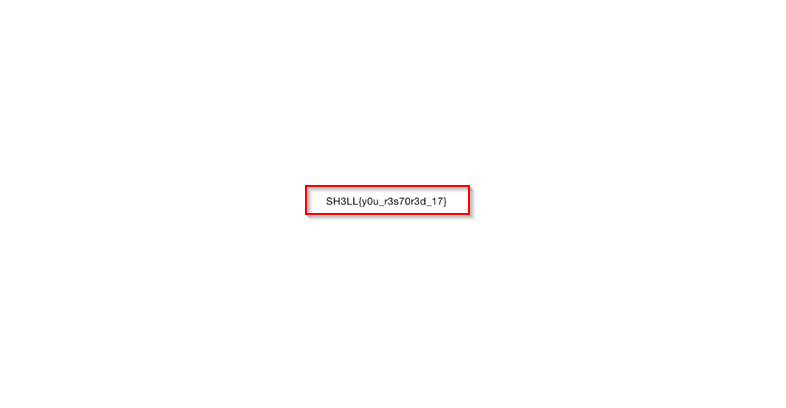

#  Corrupt File

**Category:** Misc  
**Points:** 100  

---

## 🧩 Description  
An important document was recovered during the investigation. Unfortunately, it appears to be corrupted and I don't know how to restore it.

---

## 📂 Files Provided  

- `corrupt.pdf` — corrupted PDF file with an invalid file signature.

---

## 🎯 Approach  

This is a **file signature / extension mismatch** challenge.

The file is likely:
- Not actually corrupted  
- Just incorrectly labeled  

---

## 🛠️ Steps  

1. Check file type:
   ```bash
   file coruupt.pdf
   ```

   

2. Observe mismatch (e.g., PDF but actually PNG)

3. Rename file:
   ```bash
   mv coruupt.pdf coruupt.png
   ```

5. Open the file to reveal flag

   

---

## 🏁 Flag
SH3LL{y0u_r3s70r3d_17}

---

## 🧠 Key Learning  

- File extensions can be misleading  
- Always verify real file type  
- Basic forensic checks are powerful  

