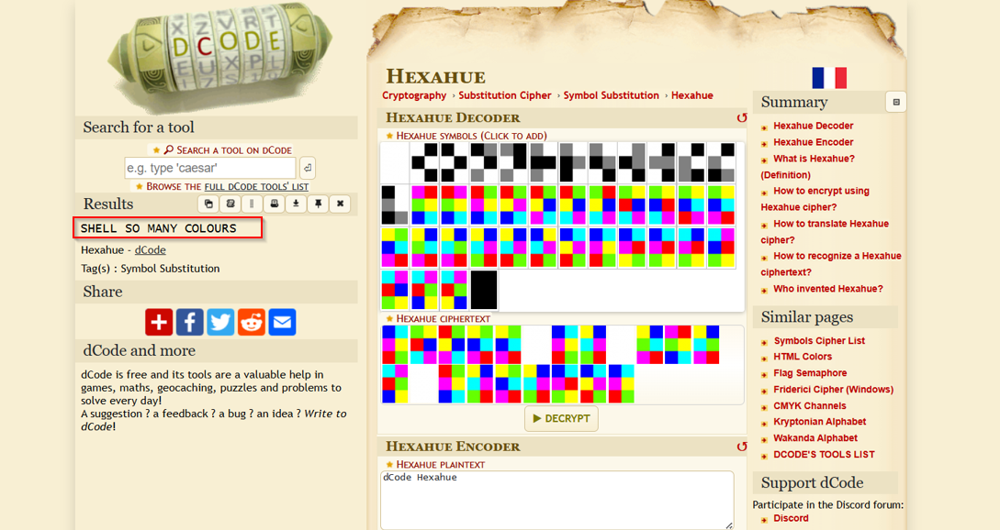

# Rainbow

**Category:** Misc  
**Points:** 100  

---

## 🧩 Description  
this looks soooooo beautiful....can u decode this?

---

## 📂 Files Provided  

- `rainbow.png` — image containing color-based encoded message.

---

## 🎯 Approach  

This is a **color-based cipher**.

- Colors represent letters  
- Likely Hexahue or similar  

---

## 🛠️ Steps  

1. Identify color pattern  
2. Use decoding tool (dCode)  
3. Map colors → letters  

   

4. Extract flag  

---

## 🏁 Flag
SHELL{SO_MANY_COLOURS}

---

## 🧠 Key Learning  

- Colors can encode data  
- Pattern recognition is key  
