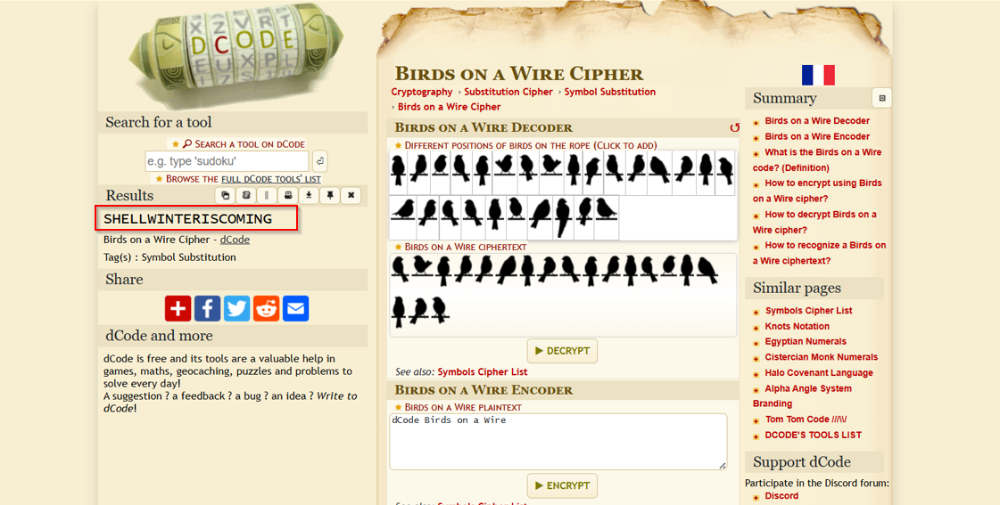

# Ravens of Winterfell

**Category:** Misc  
**Points:** 100  

---

## 🧩 Description  
Messages still travel across the North, but not all are meant to be understood at first glance. Can you interpret what the ravens carry?

---

## 📂 Files Provided  

- `ravens.png` — image containing symbols encoded using a visual cipher.

---

## 🎯 Approach  

This is a **symbolic cipher challenge**.

- Symbols represent letters  
- Inspired by themed cipher (GoT reference)

---

## 🛠️ Steps  

1. Identify cipher type (Birds on a Wire)  
2. Use decoding tool (e.g., dCode.fr)  
3. Translate symbols → text  

   

4. Format into flag  

---

## 🏁 Flag
SH3LL{winter_is_coming}

---

## 🧠 Key Learning  

- Learn common visual ciphers  
- Tools like dCode save time  
- Theme hints are important  

