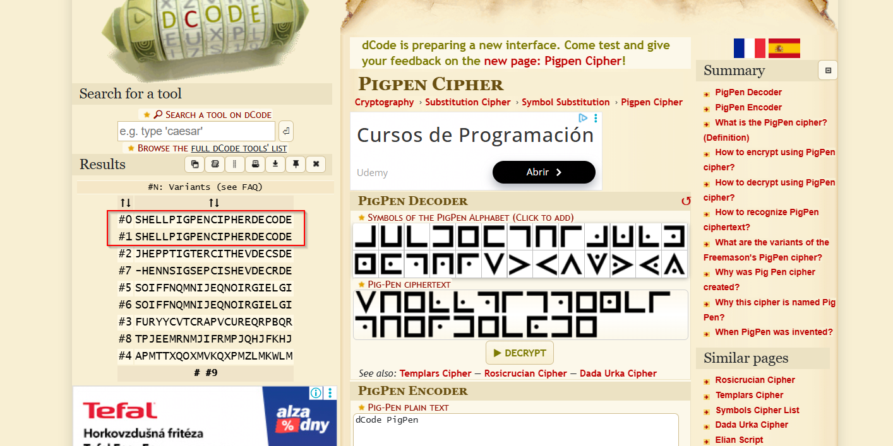

# Sacred Geometry

**Category:** Misc  
**Points:** 100  

---

## 🧩 Description  
A strange set of symbols has been recovered ,nothing but simple lines, angles, and shapes arranged with deliberate precision. At first glance, it feels like meaningless geometry… but patterns rarely lie.

---

## 📂 Files Provided  

- `sticks.png` — image containing Pigpen cipher symbols.

---

## 🎯 Approach  

This is a **Pigpen Cipher** challenge.

- Uses geometric shapes  
- Each symbol maps to a letter  

---

## 🛠️ Steps  

1. Identify cipher (Pigpen)  
2. Use standard Pigpen grid  
3. Map symbols → letters  

   

5. Construct flag  

---

## 🏁 Flag
SHELL{pigpen_cipher_decode}

---

## 🧠 Key Learning  

- Classic ciphers still appear in CTFs  
- Visual recognition is important  

