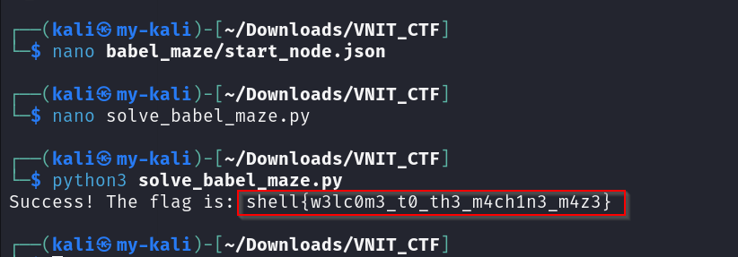

# The Labyrinth of Babel

**Category:** Misc  
**Points:** 100  

---

## 🧩 Description  
Navigate a maze of 10,000 JSON files using battery and data rules...

---

## 📂 Files Provided  

- `babel_maze.zip` — archive containing 10,000 interconnected JSON files forming a traversal maze.

---

## 🎯 Approach  

This is a **programmatic traversal challenge**.

- Requires automation  
- State tracking (battery + data)  

---

## 🛠️ Steps  

1. Extract ZIP  
2. Analyze JSON structure  
3. Write Python script:
   - Track battery & data  
   - Append characters  
   - Follow routing formula  

4. Continue until exit node  
5. Print final string

   

---

## 🏁 Flag
SHELL{w3lc0m3_t0_th3_m4ch1n3_m4z3}

---

## 🧠 Key Learning  

- Automation is essential for large data  
- State-based logic is common  
- Python is powerful for CTFs 
