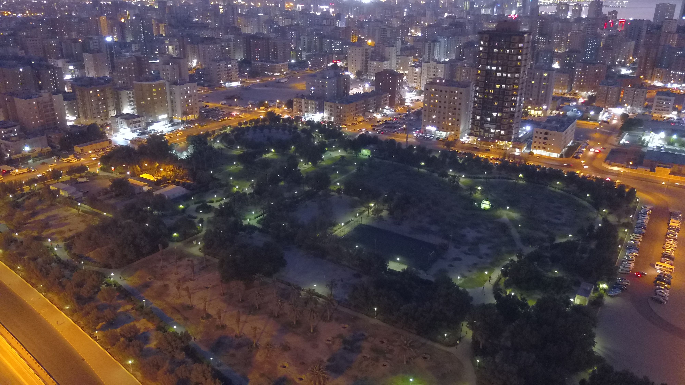

# 🌵 Garden in a Desert City
**Category:** OSINT  
**Points:** 100  

---

## 🧩 Description  
I used to play in this garden a lot as a child. Can you find it for me?

---

## 📂 Files Provided  

---

## 🎯 Approach  

This challenge is based on **geolocation via visual clues**.

- Identify environment (desert region)
- Analyze vegetation and architecture
- Use reverse image search + map comparison

---

## 🛠️ Steps  

1. Upload image to **Google Lens**

2. Observe:
   - Palm trees → Desert / Gulf region  
   - Structured garden layout  
   - Fountain and pathways  

3. Use search queries:
   - famous gardens in desert cities
   - garden kuwait palm trees fountain

4. Compare locations on:
   - Google Maps  
   - Satellite view  

5. Match layout and confirm location  

---

## 🔗 References  

[Google Lens Result](https://www.google.com/search?source=lns.web.gsbubb&vsdim=1024%2C576&gsessionid=uuYrJIHbyraclcPVfON1EcommG8urojLORbuNGDXAddHtfjQtrPX4Q&lsessionid=8k2hqWm7VHCkEb0D-luwzeIzkMx1xDoCEeQiZ-4QgbygotevGil-rQ&lns_surface=26&authuser=0&biw=1536&bih=695&hl=en-IN&vsrid=CLuQsa_m6bqvKxAFGAEiJDk3MUU3RUQ2LUE3NzItNERENC05Q0RELUEwMUY5QjFBNURFNTJ8IgJzZCgwQnQKLmxmZS1kdW1teToxOTc5YTdlZC1hZjQ4LTRhZWYtOGRhZS00MGY4YWEwYWMyMjQSQgpAL2Jucy9zZC9ib3JnL3NkL2Jucy9sZW5zLWZyb250ZW5kLWFwaS9wcm9kLmxlbnMtZnJvbnRlbmQtYXBpLzE4MDjh8_TIypWUAw&udm=24&q=where+is+this+park&vsint=CAQqCgoCCAcSAggSIAE6IwoWDQAAAD8VAAAAPx0AAIA_JQAAgD8wARCACBjABCUAAIA_&lns_mode=mu&qsubts=1777552379398&lns_fp=1&oq=where+is+this+park&gs_lp=EhNtdWx0aW1vZGFsLWxlbnMtd2ViIhJ3aGVyZSBpcyB0aGlzIHBhcmsyBRAAGMoFMgUQABjKBTIFEAAYygUyBRAAGMoFMgUQABjKBTIFEAAYygUyBRAAGMoFMgUQABjKBUipFFCsBFidEnAAeACQAQCYAYMEoAHjF6oBBzMtMy4yLjK4AQPIAQD4AQGYAgSgAsENmAMAkgcFMy0yLjKgB98hsgcFMy0yLjK4B8ENwgcFMC4zLjHIBwqACAE&sclient=multimodal-lens-web&stq=1&cs=1&lei=70vzae2iCPj4seMPk8mZCQ)

[YouTube Walkthrough](https://www.youtube.com/watch?v=nraVRggChuk)

---

## 🧠 Key Learning  

- Combine visual + geographic clues  
- Satellite view is extremely useful  
- Always verify before concluding  

