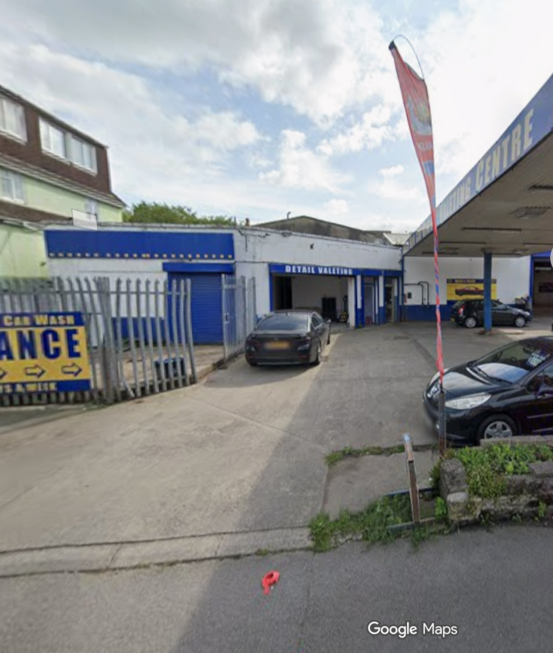
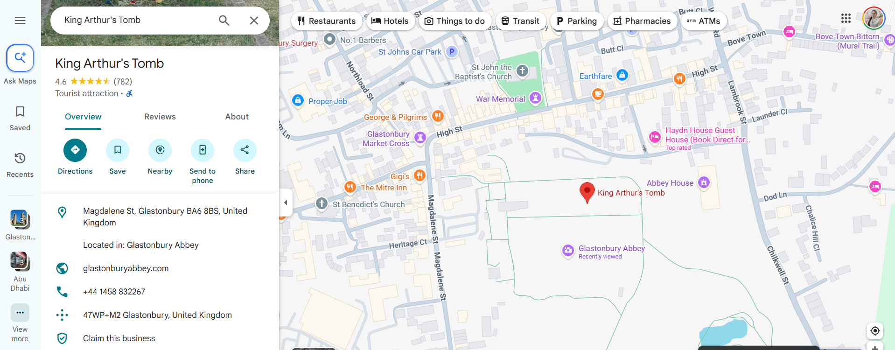

# ⚔️ Saber
**Category:** OSINT  
**Points:** 100  

---

## 🧩 Description  
Next to this unassuming car wash lies the grave of the wielder of the Sword of Promised Victory. The plus code of the place will be your flag.

---

## 📂 Files Provided  

---

## 🎯 Approach  

This challenge combines:
- **Visual OSINT (image)**
- **Riddle decoding**
- **Real-world mapping**

---

## 🧠 Riddle Breakdown  

Step 1: Decode "Sword of Promised Victory"

- Refers to **Excalibur**
- Famous weapon of **King Arthur**

BUT ALSO:
- "Saber" → reference to *Fate Series*
- Character: **Artoria Pendragon (King Arthur inspiration)**

👉 Final conclusion:
**Target = King Arthur**

---

## 🖼️ Image Analysis (IMPORTANT 🔥)

From the provided image:

- Clearly a **UK-style car wash**
- Indicators:
- Left-hand driving environment  
- UK number plates (yellow rear plate)  
- Architecture + signage style  
- “Car Wash / Detailing Centre” typical UK layout  

👉 So location is **very likely in the United Kingdom**

---

## 🛠️ Steps  

1. **Identify country from image**
- UK environment confirmed  

2. **Decode riddle**

- Sword of Promised Victory → Excalibur Wielder → King Arthur

3. **Search location**

- King Arthur grave

   

4. **Result**
- Glastonbury Abbey (England)

5. **Open in Google Maps**
- Locate nearby car-related places (car wash clue)

6. **Extract Plus Code**
- Right-click → copy Plus Code  

---

## ⚠️ Important Insight  

- The image helps confirm **country (UK)**
- The riddle gives **historical identity**
- Both combine → **precise OSINT correlation**

---

## 🔗 References  

[Google Maps Location](https://www.google.com/maps/place/Avalon+Hand+Car+Wash/@51.1443864,-2.7180592,3a,75y,161.21h,94.97t/data=!3m7!1e1!3m5!1s7zZgAJFzviS4MObBqWxpyg!2e0!6shttps:%2F%2Fstreetviewpixels-pa.googleapis.com%2Fv1%2Fthumbnail%3Fcb_client%3Dmaps_sv.tactile%26w%3D900%26h%3D600%26pitch%3D-4.969999999999999%26panoid%3D7zZgAJFzviS4MObBqWxpyg%26yaw%3D161.21!7i16384!8i8192!4m14!1m6!3m5!2zNTHCsDA4JzM5LjQiTiAywrA0MycwNS4yIlc!8m2!3d51.1442778!4d-2.7181111!10e5!3m6!1s0x4872177e96cf9c23:0x5577dcc67f61064d!8m2!3d51.144279!4d-2.7181155!10e5!16s%2Fg%2F11ddwyzc2x?entry=ttu&g_ep=EgoyMDI2MDQyOC4wIKXMDSoASAFQAw%3D%3D)

[Glastonbury Abbey](https://www.google.com/maps/place/Glastonbury+Abbey/@51.1460362,-2.7152768,260m/data=!3m1!1e3!4m6!3m5!1s0x4872177e35c2961d:0x85daaab4c0d7e169!8m2!3d51.1460616!4d-2.7152674!16zL20vMDJiajV0?entry=ttu&g_ep=EgoyMDI2MDQyOC4wIKXMDSoASAFQAw%3D%3D)

[King Arthur's Tomb](https://www.google.com/maps/place/King+Arthur's+Tomb/@51.1467173,-2.716204,260m/data=!3m2!1e3!4b1!4m6!3m5!1s0x4872177f8acb4335:0xe83d105bccecf14e!8m2!3d51.1467156!4d-2.7149165!16s%2Fg%2F11cn95jmfc?entry=ttu&g_ep=EgoyMDI2MDQyOC4wIKXMDSoASAFQAw%3D%3D)

---

## 🧠 Key Learning  

- OSINT often mixes:
- Pop culture  
- History  
- Real-world locations  

- Always:
- Use image to narrow region  
- Use riddle to identify target  

- Combining both = faster solving 🚀  

