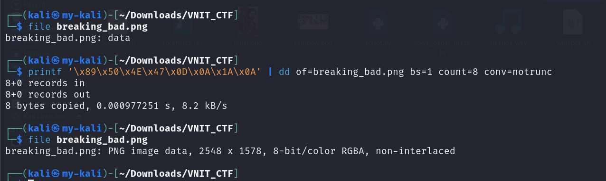
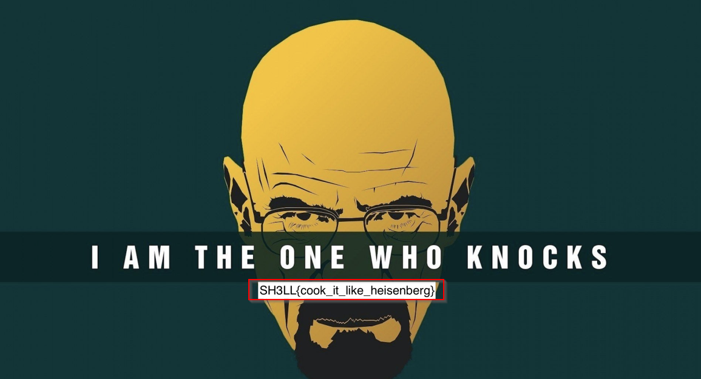

# Breaking Bad

**Category:** Steganography  
**Points:** 200  

---

## 🧩 Description
"It’s not just chemistry, Jesse. It’s art." Walter White demands perfection. He sent you a sample of the new batch's chemical structure, but something is wrong.Can u find it out?

---

## 📂 Files Provided

- `breaking_bad.png` — corrupted PNG image with an invalid file header

---

## 🎯 Approach
The challenge involved repairing a corrupted image file.

File signature corruption is a common trick in steganography challenges, where headers are intentionally modified to prevent proper viewing.  

---

## 🛠️ Steps

1. Identify file type:
   ```bash
   file breaking_bad.png
   ```
   
2. Notice incorrect header

   

3. Fix PNG header manually:
   ```bash
    printf '\x89\x50\x4E\x47\x0D\x0A\x1A\x0A' | dd of=breaking_bad.png bs=1 count=8 conv=notrunc
   ```

4. Open repaired image

   

---

## 🏁 Flag
SH3LL{cook_it_like_heisenberg}

---

## 🧠 Key Learning
- File headers (magic bytes) are critical
- Small corruption can hide entire data
