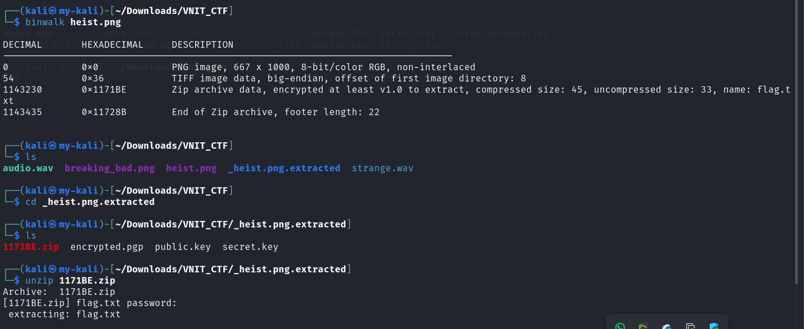
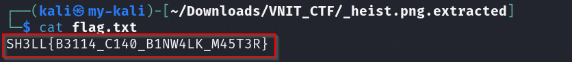

# La Casa de Papel

**Category:** Steganography  
**Points:** 300  

---

## 🧩 Description
The Professor’s plan is simple: Walk into the bank, walk past the guards, and walk straight into the binary vault.

---

## 📂 Files Provided

- `heist.png` — image file suspected to contain embedded data.

---

## 🎯 Approach
This challenge involved detecting and extracting embedded files from an image.

Steganography often hides compressed archives inside images using file carving techniques. :contentReference[oaicite:3]{index=3}  

---

## 🛠️ Steps

1. Scan image for embedded data:
  ```bash
  binwalk heist.png
  ```

3. Extract embedded files:
  ```bash
  binwalk -e heist.png
  ```

3. Navigate extracted folder:
  ```bash
  cd _heist.png.extracted
  ```

4. Extract archive:
  ```bash
  unzip 1171BE.zip
  ```


## ⚠️ Note

The embedded archive was password-protected.  
Due to incomplete records, the exact method used to retrieve the password is not documented here.

However, the intended approach involved extracting embedded data from the image and using contextual clues to recover the password.

5. Read flag:
  ```bash
  cat flag.txt
  ```


---

## 🏁 Flag
SH3LL{B3114_C140_B1NW4LK_M45T3R}

---

## 🧠 Key Learning
- Use binwalk for file carving
- Hidden archives are common in images
- Always inspect extracted data carefully
