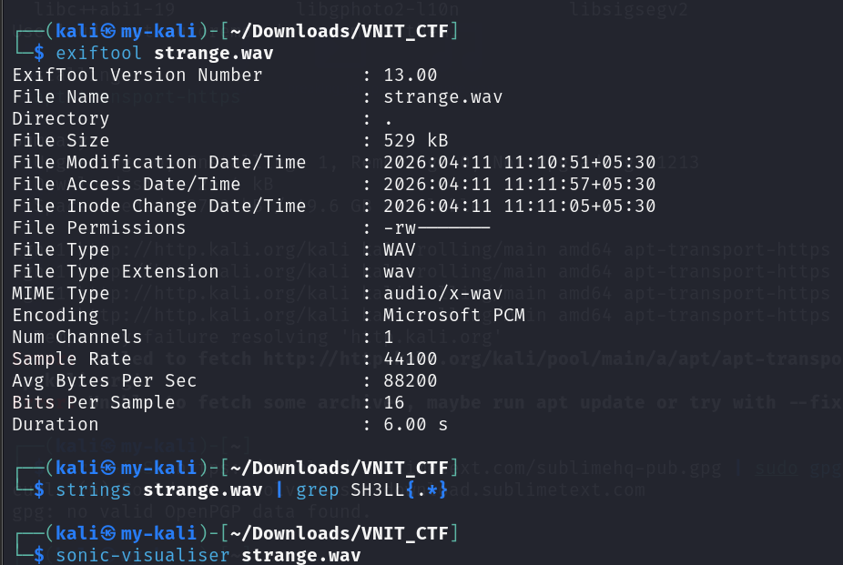
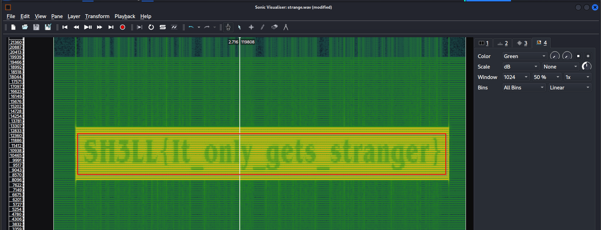

# Stranger Frequencies

**Category:** Steganography  
**Points:** 200  

---

## 🧩 Description
The lights are flickering again. We recorded the low-frequency hum vibrating through the basement walls. Can you find out the message before the gate opens?

---

## 🎯 Approach
This challenge required analyzing hidden data in audio frequencies.

Audio steganography often hides data in spectrograms, where visual patterns appear in frequency space.  

---

## 🛠️ Steps

1. Analyze the file and Open the audio file in:
   - Sonic Visualiser / Audacity

  

3. Enable spectrogram view  

4. Observe frequency patterns  

5. Identify embedded text visually  

  
  
---

## 🏁 Flag

SH3LL{It_only_gets_stranger}

---

## 🧠 Key Learning
- Spectrograms can reveal hidden messages  
- Audio = visual data when analyzed properly  

