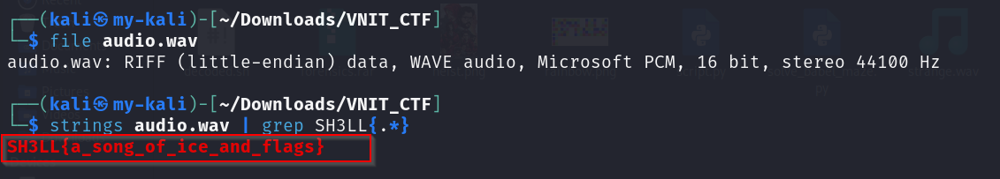

# The Silent Throne

**Category:** Steganography  
**Points:** 100  

---

## 🧩 Description
The throne was never empty, it was silent. Something was hidden in the sound left behind.

---

## 🎯 Approach
The challenge involved analyzing an audio file to identify hidden information.  
In steganography, data is often hidden inside media files such as audio using metadata or embedded plaintext.

The strategy was to inspect the file for any readable strings.

---

## 🛠️ Steps

1. Verify file type:
   ```bash
   file audio.wav
   ```
   
2. Extract readable strings:
   ```bash
   strings audio.wav
   ```

3. Filter for flag pattern:
   ```bash
   strings audio.wav | grep SH3LL{.*}
   ```



## 🏁 Flag
SH3LL{a_song_of_ice_and_flags}
