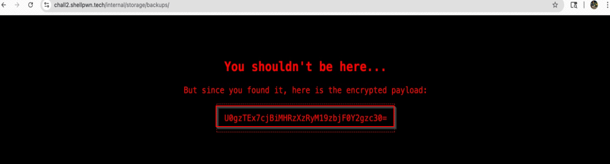
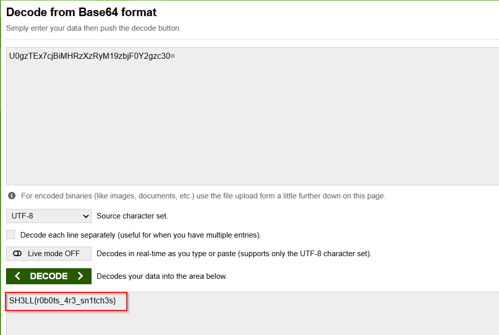

# Not for Human Eyes

**Category:** Web  
**Points:** 200  

---

## 🧩 Description  
If you knew where the site tells others not to go, you might find something interesting. Alert :You’re entering a zone filled with distractions and deliberate misleads

---

## 🎯 Target  
- **URL:** https://chall2.shellpwn.tech  

---

## 🎯 Approach  

This challenge involves discovering hidden paths using **robots.txt** and decoding the retrieved data.

---

## 🛠️ Steps  

1. Navigate to:

/robots.txt

2. Identify disallowed paths  
3. Visit the hidden directory  

   

4. Locate encoded content  
5. Decode the data to reveal the flag

   

---

## 🏁 Flag  
SH3LL{r0b0ts_4r3_sn1tch3s}

---

### 🧠 Key Learning  

- robots.txt can expose sensitive endpoints  
- Encoding is often used to obfuscate data  

