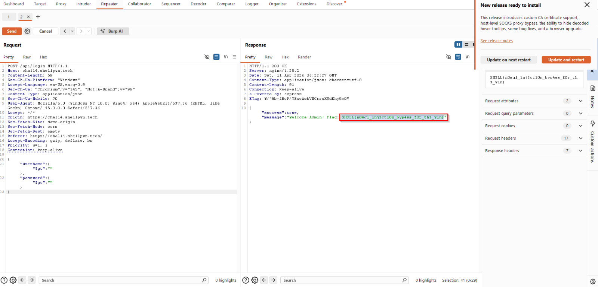

# Trust Issues

**Category:** Web  
**Points:** 300  

---

## 🧩 Description  
The system believes in trust. You just need to understand how that belief is enforced… or broken. Give me a minute, I dropped my key somewhere....Meanwhile, see if you can figure out how this works.

---

## 🎯 Target  
- **URL:** https://chall3.shellpwn.tech  

---

## 🎯 Approach  

This challenge is based on **manipulating client-side trust mechanisms** such as cookies or request parameters.

---

## 🛠️ Steps  

1. Intercept requests using **Burp Suite**  
2. Analyze cookies and parameters  
3. Identify trust-based values (e.g., role, user type)  
4. Modify these values in the request  
5. Forward the request  

   

6. Observe elevated access and retrieve the flag  

---

## 🏁 Flag  
SH3LL{n0sql_1nj3ct10n_byp4ss_f0r_th3_w1n}

---

## 🧠 Key Learning  

- Never trust client-side data  
- Parameter tampering is a common vulnerability  

