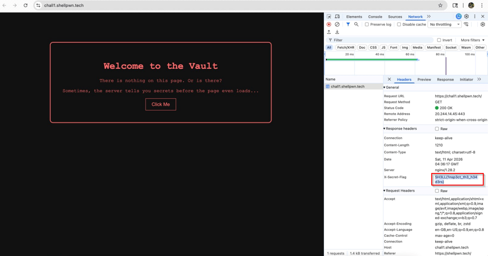

# Under the Hood

**Category:** Web  
**Points:** 100  

---

## 🧩 Description  
The website looks completely normal on the surface, but sometimes the most interesting conversations happen out of sight. Open up your dev tools are you listening to it?

---

## 🎯 Target  
- **URL:** https://chall1.shellpwn.tech  

---

## 🎯 Approach  

The challenge focuses on **analyzing HTTP response metadata** to find hidden information.

---

## 🛠️ Steps  

1. Open the website in a browser  
2. Open Developer Tools (`F12`)  
3. Navigate to the **Network tab**  
4. Refresh the page  
5. Select the main request  
6. Inspect **Response Headers**  

   

7. Identify the custom header containing the flag  

---

## 🏁 Flag  
SH3LL{1nsp3ct_th3_h34d3rs}

---

## 🧠 Key Learning  

- HTTP headers can leak sensitive information  
- Always inspect requests and responses  

